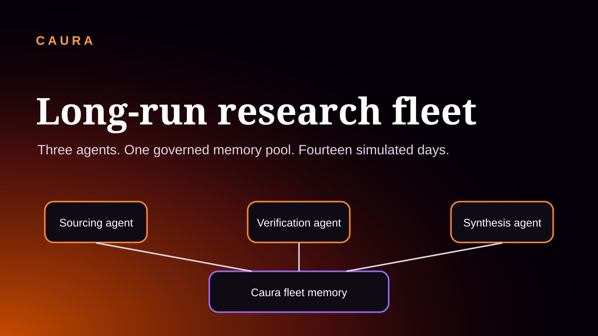
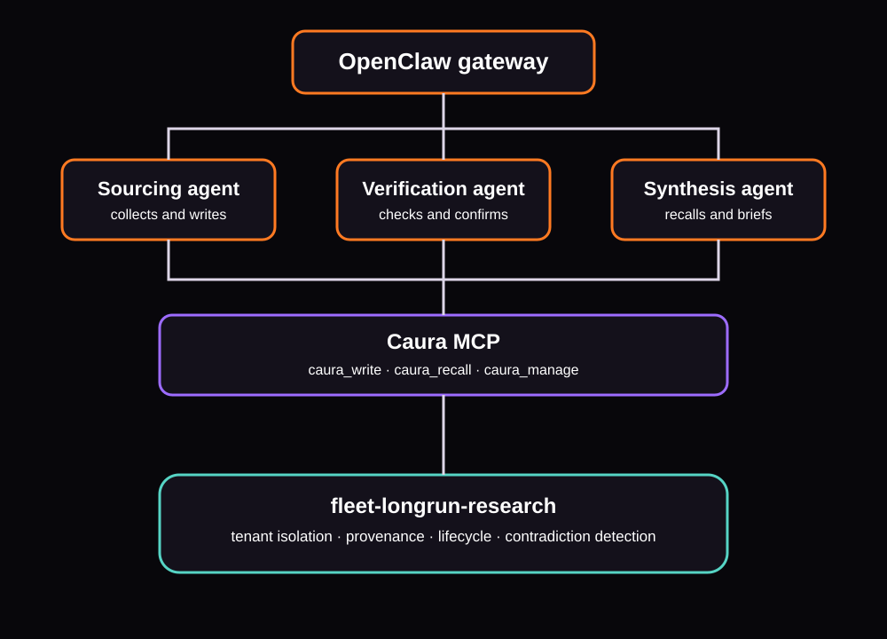

<div align="center">
  <a href="https://caura.ai">
    
  </a>

  <p>
    <a href="LICENSE"></a>
    <a href="https://caura.ai/docs"></a>
    <a href="https://github.com/caura-ai/caura"></a>
    <a href="https://docs.openclaw.ai"></a>
    <a href="simulate.py"></a>
  </p>

  <h3>Three agents. One governed memory pool. Fourteen simulated days.</h3>

  <p>
    A runnable reference fleet showing how sourcing, verification, and synthesis
    agents share durable memory through Caura while retaining authorship,
    lifecycle state, and an auditable contradiction chain.
  </p>

  <p>
    <a href="#what-this-demonstrates"><b>What it demonstrates</b></a> ·
    <a href="#architecture"><b>Architecture</b></a> ·
    <a href="#quickstart"><b>Quickstart</b></a> ·
    <a href="#run-the-simulation"><b>Run</b></a> ·
    <a href="#compatibility-identifiers"><b>Compatibility</b></a>
  </p>
</div>

## What this demonstrates

[Caura](https://github.com/caura-ai/caura) is an open-source, governed shared-memory layer for AI agent fleets. This example runs three OpenClaw agents against one `fleet_id`:

- **Sourcing** records a competitor price each day.
- **Verification** reads sourcing's records and confirms the current fact.
- **Synthesis** recalls only governed current knowledge and produces a daily brief.

On Day 9, the price changes from `$299` to `$349`. Caura writes the new fact, runs asynchronous contradiction detection, links the supersession chain, and transitions contradicted records out of the default recall surface. `simulate.py` waits for `GET /memories/{memory_id}/contradictions` to report evidence before starting synthesis.

This is a fleet-memory example, not a generic vector-search demo: writes carry `agent_id`, reads are scoped by `fleet_id`, lifecycle state is server-side, and the final brief cites the memory IDs that informed it.

| Capability | How the fleet uses it |
| --- | --- |
| Shared fleet memory | All three agents read and write `fleet-longrun-research` |
| Attribution | Every operation identifies the acting agent |
| Governed recall | Default recall excludes outdated, conflicted, archived, and deleted rows |
| Contradiction handling | A newer conflicting fact supersedes the older fact asynchronously |
| Auditability | Synthesis reports the memory IDs behind its brief |

Primary links: [Caura OSS repository](https://github.com/caura-ai/caura) · [documentation](https://caura.ai/docs) · [agent-memory guide](https://caura.ai/agent-memory/)

## Architecture

<div align="center">
  
</div>

OpenClaw routes prompts to the named agents and exposes Caura's current MCP tools:

| Tool | Purpose in this example |
| --- | --- |
| `caura_write` | Store pricing facts and verification notes |
| `caura_recall` | Search the shared fleet with governed status filtering |
| `caura_manage op=transition` | Confirm a verified memory |

The REST poll used after the Day 9 write is part of the current public API: `GET /api/v1/memories/{memory_id}/contradictions?tenant_id=...`.

## Repository structure

```text
caura-long-run-fleet/
├── simulate.py
├── openclaw.json
├── .env.example
├── agents/
│   ├── sourcing-agent/{SOUL.md,AGENTS.md}
│   ├── verification-agent/{SOUL.md,AGENTS.md}
│   └── synthesis-agent/{SOUL.md,AGENTS.md}
├── skills/caura-research-fleet.md
└── tests/test_repo.py
```

## Prerequisites

- Python 3.9+
- Node.js 18+
- [OpenClaw](https://docs.openclaw.ai): `npm install -g openclaw@latest`
- A self-hosted Caura deployment or managed Caura credentials
- An OpenAI-compatible LLM endpoint for the OpenClaw agents

## Create a fleet

Managed Caura:

```bash
curl -X POST "https://caura.ai/api/v1/fleet" \
  -H "X-API-Key: $CAURA_API_KEY" \
  -H "Content-Type: application/json" \
  -d "{\"tenant_id\": \"$CAURA_TENANT_ID\", \"fleet_id\": \"fleet-longrun-research\", \"display_name\": \"Long-Run Research Fleet\"}"
```

Self-hosted Caura:

```bash
git clone https://github.com/caura-ai/caura.git
cd caura
docker compose up -d

curl -X POST "http://localhost:8000/api/v1/fleet" \
  -H "Content-Type: application/json" \
  -d '{"tenant_id":"local","fleet_id":"fleet-longrun-research","display_name":"Long-Run Research Fleet"}'
```

## Quickstart

### 1. Clone and configure

```bash
git clone https://github.com/caura-ai/caura-long-run-fleet.git
cd caura-long-run-fleet
cp .env.example .env
cp openclaw.json ~/.openclaw/openclaw.json
```

Set the canonical variables in `.env`:

```bash
CAURA_API_URL=https://caura.ai/api/v1
CAURA_API_KEY=mc_your_key_here
CAURA_TENANT_ID=your_tenant_id_here
CAURA_FLEET_ID=fleet-longrun-research
LLM_GATEWAY_API_KEY=your_llm_key_here
OPENCLAW_GATEWAY_URL=http://127.0.0.1:18789
```

For self-hosting, set `CAURA_API_URL=http://localhost:8000/api/v1`. Review and replace the placeholder LLM provider URL and model in `openclaw.json` before starting OpenClaw.

### 2. Choose one Caura connection path

The checked-in `openclaw.json` connects directly to the local Caura MCP endpoint. For the managed service or for plugin-managed context injection, install the OpenClaw plugin instead:

```bash
CAURA_URL=https://caura.ai
CAURA_KEY="$CAURA_API_KEY"

INSTALLER=$(mktemp)
curl -sf -H "X-API-Key: $CAURA_KEY" \
  "$CAURA_URL/api/v1/install-plugin?fleet_id=fleet-longrun-research&api_url=$CAURA_URL" \
  --output "$INSTALLER"

# Read the entire downloaded script before executing it.
${PAGER:-less} "$INSTALLER"
bash "$INSTALLER"
```

Do not configure the direct MCP entry and the plugin as two competing memory providers in the same OpenClaw slot. Follow the installer output when using the plugin path.

### 3. Deploy agent workspaces

```bash
REPO=$(pwd)

cp -r "$REPO/agents/sourcing-agent"     ~/.openclaw/workspace-sourcing-agent
cp -r "$REPO/agents/verification-agent" ~/.openclaw/workspace-verification-agent
cp -r "$REPO/agents/synthesis-agent"    ~/.openclaw/workspace-synthesis-agent

for agent in sourcing-agent verification-agent synthesis-agent; do
  mkdir -p ~/.openclaw/workspace-$agent/skills
  cp "$REPO/skills/caura-research-fleet.md" ~/.openclaw/workspace-$agent/skills/
done

openclaw agents add sourcing-agent     --workspace ~/.openclaw/workspace-sourcing-agent     --non-interactive
openclaw agents add verification-agent --workspace ~/.openclaw/workspace-verification-agent --non-interactive
openclaw agents add synthesis-agent    --workspace ~/.openclaw/workspace-synthesis-agent    --non-interactive
python scripts/openclaw_with_caura_env.py \
  --env-file .env --config ~/.openclaw/openclaw.json --check
python scripts/openclaw_with_caura_env.py \
  --env-file .env --config ~/.openclaw/openclaw.json -- openclaw gateway start
```

`simulate.py` reads the repo's `.env` file directly. The launcher validates the copied JSON, resolves each first non-empty `CAURA_*` value with its supported legacy fallback, and exports only canonical names to the OpenClaw child process without writing secrets into the JSON. It uses an argv list rather than a shell and therefore works on macOS, Linux, and Windows. Windows users should also use absolute workspace paths when registering agents.

### 4. Verify the connection

```bash
openclaw doctor
openclaw agents list
```

Run those commands through `scripts/openclaw_with_caura_env.py` too when the gateway process does not already inherit your `.env` values.

When installed through Caura's plugin installer, `openclaw doctor` may print the retained plugin ID `memclaw`; this is expected and documented below. <!-- legacy-name-ok: frozen OpenClaw plugin id -->

## Run the simulation

```bash
python -m pip install -r requirements.txt
python simulate.py --dry-run --days 1 9 10 --delay 0
python simulate.py
```

Each simulated day:

1. Sourcing and Verification run concurrently.
2. Both complete before Synthesis begins.
3. On Day 9, the runner polls the contradiction endpoint for the new memory before Synthesis recalls.
4. Synthesis produces a governed brief and stores a brief-completion record.

Useful flags:

```bash
python simulate.py --start 9 --end 10
python simulate.py --days 1 9 10
python simulate.py --delay 0
```

## Compatibility identifiers

Caura was formerly named MemClaw. New examples and public links use Caura. <!-- legacy-name-ok: historical alias needed to identify the compatibility boundary -->

Compatibility surfaces retained deliberately:

1. The OpenClaw plugin ID is `memclaw`. <!-- legacy-name-ok: frozen OpenClaw plugin id -->
2. The plugin installs at `~/.openclaw/plugins/memclaw/`. <!-- legacy-name-ok: frozen plugin install path -->
3. Non-empty `MEMCLAW_API_URL`, `MEMCLAW_API_KEY`, `MEMCLAW_TENANT_ID`, and `MEMCLAW_FLEET_ID` values remain fallbacks for existing deployments; the corresponding `CAURA_*` value wins when both are non-empty. <!-- legacy-name-ok: supported non-empty env fallbacks -->
4. `skills/memclaw-research-fleet.md` remains a compatibility document that points to the canonical Caura skill. <!-- legacy-name-ok: historical inbound skill path -->
5. The historical `docs/images/memclaw-architecture-updated-flow.png`, `docs/images/memclaw-long-run-fleet-demo.gif`, and `docs/images/memclaw_longrun_fleet_hero.svg` URLs remain present for inbound links. They are not embedded as current product visuals; the README uses the Caura SVGs above. <!-- legacy-name-ok: historical inbound asset paths -->

These compatibility identifiers are not the active product name. Do not use the old domain, old repository path, or old `memclaw_*` MCP tool names in new configuration. <!-- legacy-name-ok: prohibition names retired surfaces -->

## Security

- Never commit `.env` or live credentials; `.env` is ignored.
- Use HTTPS for any hosted `CAURA_API_URL`.
- Keep API keys in environment variables, not directly in `openclaw.json`.
- Review the plugin installer response before piping it to a shell.
- Rotate any key exposed in terminal output, version history, or chat exports.

## Validation

```bash
python -m unittest discover -s tests -v
python scripts/check_legacy_brand.py
python scripts/check_links.py
python scripts/check_repository_settings.py
python scripts/cross_agent_smoke.py
python -m json.tool openclaw.json >/dev/null
python -m py_compile simulate.py scripts/*.py tests/test_repo.py
```

The cross-agent smoke is offline by default. See the [local smoke runbook](docs/CROSS-AGENT-SMOKE.md) before enabling network access. HTTP examples are pinned and source-checked against the commit recorded in [OSS-CONTRACT.md](docs/OSS-CONTRACT.md). GitHub-side description, topics, and preview work remains an explicit [human settings handoff](docs/REPOSITORY-SETTINGS.md).

## Related

- [Caura OSS repository](https://github.com/caura-ai/caura)
- [Caura documentation](https://caura.ai/docs)
- [Caura agent-memory guide](https://caura.ai/agent-memory/)
- [OpenClaw documentation](https://docs.openclaw.ai)

---

<div align="center">
  Built on <a href="https://github.com/caura-ai/caura"><b>Caura</b></a>, open-source governed memory for AI agent fleets.
</div>
